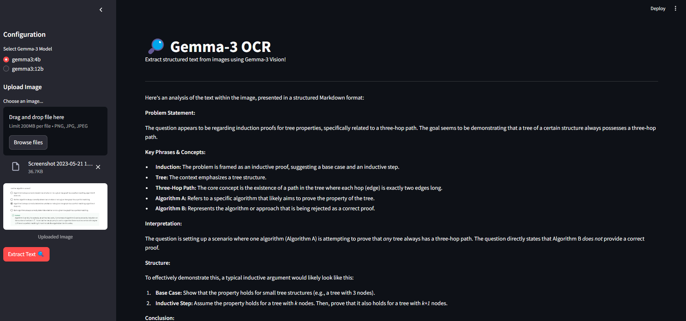
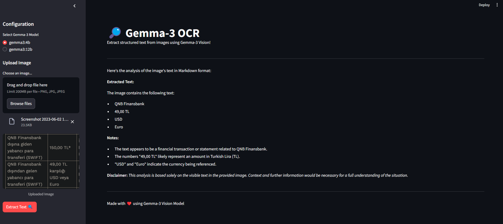

# Gemma-3 OCR

Gemma-3 OCR is a web application that allows users to extract structured text from images using the Gemma-3 Vision model. The application is built with Streamlit and leverages the Ollama API for image processing.

## Features

- **Image Upload**: Users can upload images in PNG, JPG, or JPEG formats.
- **Model Selection**: Choose between different Gemma-3 models for text extraction. 
```	
"gemma3:4b", "gemma3:12b"
```
- **Text Extraction**: Extracts readable content from images and presents it in a structured Markdown format.
- **User-Friendly Interface**: Simple and intuitive interface powered by Streamlit.

## Getting Started

### Prerequisites

- Python 3.12
- Streamlit
- Pillow
- Ollama

### Installation

1. **Clone the repository**:
   ```bash
   git clone https://github.com/tahsinsoyak/llm-ocr-apps.git
   cd gemma3-ocr
   ```

2. **Install dependencies**:
   ```bash
   pip install -r requirements.txt
   ```

3. **Run the application**:
   ```bash
   streamlit run app.py
   ```

## Usage

1. **Upload an Image**: Use the sidebar to upload an image file.
2. **Select a Model**: Choose the desired Gemma-3 model for processing.
3. **Extract Text**: Click the "Extract Text" button to process the image and view the results.

## Screenshots



## Contributing

Contributions are welcome! Please fork the repository and submit a pull request for any improvements or bug fixes.

## Acknowledgments

- Built with ❤️ using the Gemma-3 Vision Model
- Powered by Streamlit and Ollama

For any questions or support, please contact [tahsinsoyakk@gmail.com].
