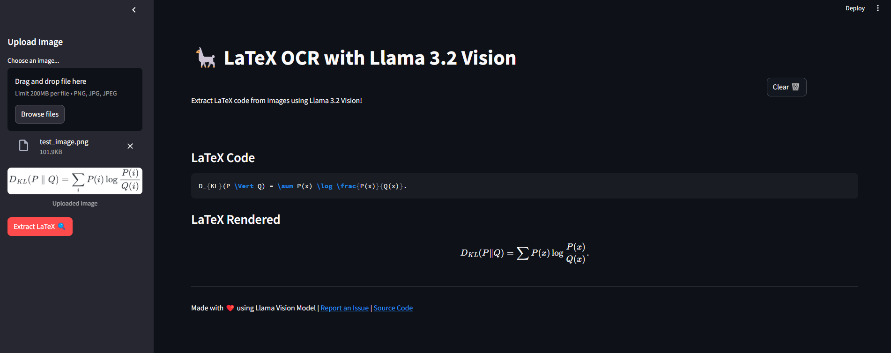
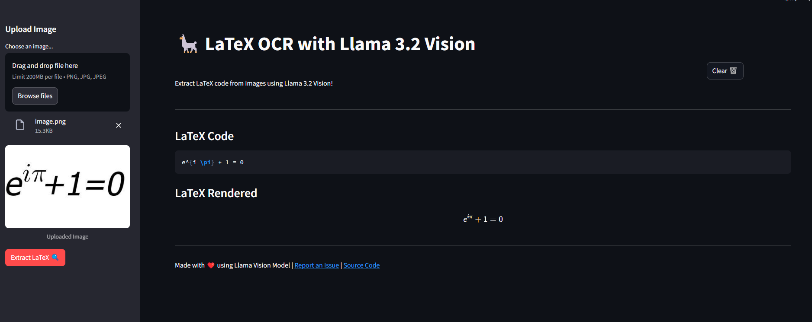
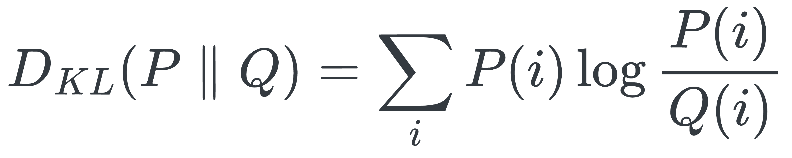
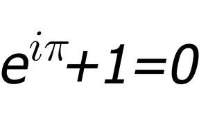

# LaTeX OCR with Llama 3.2 Vision

LaTeX OCR with Llama 3.2 Vision is a web application designed to extract LaTeX code from images containing mathematical equations. The application is built using Streamlit and utilizes the Ollama API for image processing.

## Features

- **Image Upload**: Users can upload images in PNG, JPG, or JPEG formats.
- **LaTeX Extraction**: Extracts LaTeX code from images of mathematical equations.
- **Clear Button**: Easily clear results and start a new extraction.
- **User-Friendly Interface**: Simple and intuitive interface powered by Streamlit.

## Getting Started

### Prerequisites

- Python 3.12 
- Streamlit
- Pillow
- Ollama

### Installation

1. **Clone the repository**:
   ```bash
   git clone https://github.com/tahsinsoyak/llm-ocr-apps.git
   cd llama3.2-latex-ocr
   ```

2. **Install dependencies**:
   ```bash
   pip install -r requirements.txt
   ```

3. **Run the application**:
   ```bash
   streamlit run app.py
   ```

## Usage

1. **Upload an Image**: Use the sidebar to upload an image file.
2. **Extract LaTeX**: Click the "Extract LaTeX" button to process the image and view the results.
3. **Clear Results**: Use the "Clear" button to reset the application for a new extraction.

## Screenshots



## Test Images




## Contributing

Contributions are welcome! Please fork the repository and submit a pull request for any improvements or bug fixes.

## Acknowledgments

- Built with ❤️ using the Llama Vision Model
- Powered by Streamlit and Ollama

For any questions or support, please contact [tahsinsoyakk@gmail.com].
