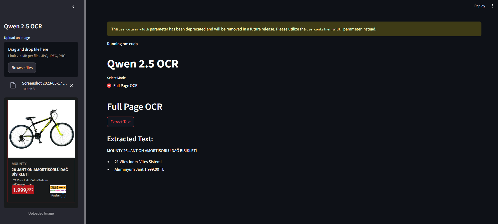

# Qwen 2.5 OCR Application

## Overview

The Qwen 2.5 OCR application is a web-based tool that utilizes the Qwen2-VL model for Optical Character Recognition (OCR) on uploaded images. It is built using Streamlit, a Python library for creating interactive web applications. The application allows users to upload images and extract readable text using advanced machine learning models.

## Features

- **Image Upload**: Users can upload images in JPG, JPEG, or PNG formats.
- **Full Page OCR**: Extracts all readable text from the uploaded image.
- **GPU Support**: Utilizes GPU for faster processing if available.
- **Interactive UI**: Built with Streamlit for a user-friendly interface.

## Requirements

- Python 3.12
- Streamlit
- PyTorch
- Transformers library
- PIL (Pillow)

## Setup Instructions

1. **Clone the Repository**:
   ```bash
   git clone <repository-url>
   cd qwen-2.5vl-ocr
   ```

2. **Install Dependencies**:
   Ensure you have Python and pip installed. Then, run:
   ```bash
   pip install -r requirements.txt
   ```

3. **Run the Application**:
   Start the Streamlit server by executing:
   ```bash
   streamlit run app.py
   ```

4. **Access the Application**:
   Open your web browser and navigate to `http://localhost:8501` to access the application.

## Usage

1. **Upload an Image**:
   - Use the sidebar to upload an image file (JPG, JPEG, PNG).

2. **Select Mode**:
   - Choose "Full Page OCR" from the mode selection.

3. **Extract Text**:
   - Click the "Extract Text" button to process the image and display the extracted text.

## Troubleshooting

- **GPU Not Detected**: Ensure that your system has a compatible GPU and the necessary drivers are installed.
- **Model Loading Issues**: Verify that you have a stable internet connection to download the model weights.

## Screenshots



## Acknowledgments

- Built with [Streamlit](https://streamlit.io/)
- Powered by [PyTorch](https://pytorch.org/) and [Transformers](https://huggingface.co/transformers/)

